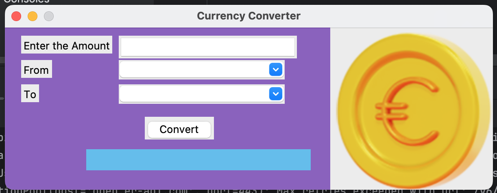
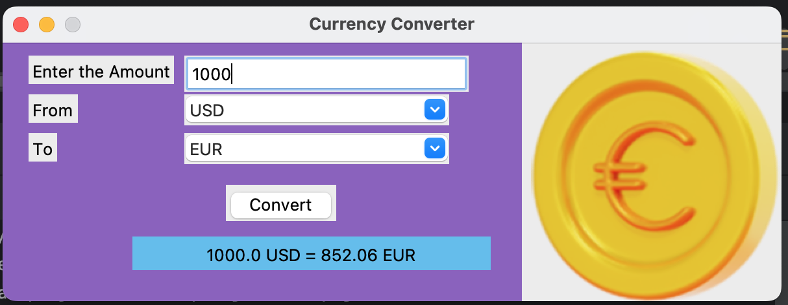

# Currency Converter (نرم افزار تبدیل ارز)

**English:**  
Currency Converter is a Python application for **real-time currency conversion**.  
Users can select source and target currencies and get the updated exchange rate.

**فارسی:**  
این نرم افزار برای **تبدیل ارزهای مختلف به هم با نرخ روز** طراحی شده است.  
کاربر می‌تواند ارز مبدأ و مقصد را انتخاب کند و مقدار مورد نظر را به نرخ روز دریافت نماید.

---

## Features (ویژگی‌ها)

**English:**  
- Convert different currencies quickly  
- Use real-time exchange rates (can be extended with live API)  
- Simple and user-friendly interface  

**فارسی:**  
- تبدیل سریع ارزهای مختلف به یکدیگر  
- استفاده از نرخ روز (قابل توسعه با API واقعی)  
- رابط کاربری ساده و قابل فهم  

---

## Screenshot (اسکرین‌شات)





---

## How to Run (نحوه اجرا)

**English:**  
```bash
# Create virtual environment (optional but recommended)
python -m venv .venv
source .venv/bin/activate    # On Windows: .venv\Scripts\activate

# Install dependencies
pip install -r requirements.txt

# Run the program
python main.py

# ساخت محیط مجازی (اختیاری ولی پیشنهادی)
python -m venv .venv
source .venv/bin/activate    # روی ویندوز: .venv\Scripts\activate

# نصب پیش‌نیازها
pip install -r requirements.txt

# اجرای برنامه
python main.py

Currency/
│── main.py
│── README.md
│── .gitignore
│
├── img/
├── Pl/
│   └── Form/
│       └── selCurFrm.py
└── venv/   (ignored)
